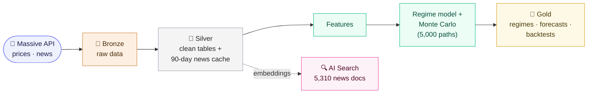
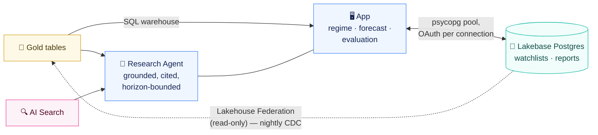

# Regime-Aware Market Intelligence Agent

An end-to-end Databricks data engineering and AI application: it ingests market
and news data, builds Bronze/Silver/Gold lakehouse layers, models market
volatility regimes, generates bounded 5-day probabilistic forecasts, and exposes
cited research through a deployed agent that explains the numbers — and refuses
to invent them.

`Python` · `PySpark` · `SQL` · `Databricks` · `Delta Lake` · `Lakebase (Postgres)` · `AI Search` · `Lakehouse Federation` · `Streamlit`

Built with AI-assisted development using Cursor. I reviewed the generated code, defined the architecture and constraints, and validated changes through tests and deployed runs.

**Author:** Writam Nanda · [LinkedIn](https://www.linkedin.com/in/writam-nanda-0bba19410/) · [GitHub](https://github.com/nw313009)

---

## What it does

Five tickers, daily. Prices and news are ingested from the Massive API into a
Bronze/Silver/Gold Delta lakehouse. A Markov-switching model estimates a calm
and a turbulent volatility regime from the price history; a Monte Carlo
simulation of 5,000 paths, optionally conditioned on current news sentiment,
turns the current regime into a distribution of prices at a 5-trading-day
horizon. A Streamlit app deployed as a Databricks App serves the regime read,
the forecast, and a research agent that answers questions about a ticker by
reading the Gold tables and a vector-search index of recent news — grounding
every claim in a tool result and naming the articles it used.

The agent explains. It does not advise, and it does not extrapolate.
**Investment recommendations are intentionally out of scope.**

## Architecture

**The daily pipeline** — one 8-task Databricks workflow, medallion layers left
to right:



**Serving** — a Streamlit app deployed as a Databricks App, with the agent and
the operational database:



Two boundaries in these diagrams were earned the hard way (see
[Findings](#findings-the-interesting-parts)):

- **The app container is the only place psycopg runs.** Serverless notebook
  kernels SIGABRT on importing it; the import boundary is enforced by a test.
- **Serverless jobs cannot reach the Lakebase Postgres endpoint at all** — the
  hostname does not resolve from serverless compute. The nightly CDC sync
  therefore reads Postgres through a Lakehouse Federation foreign catalog
  (a dedicated `federation_reader` role, SELECT-only), not JDBC.

## Screenshots

| | |
|---|---|
|  | **The app.** Regime probabilities, forecast percentiles, and the evaluation table, read from Gold over a serverless SQL warehouse. |
|  | **The horizon guardrail.** Asked for a monthly prediction, the agent states the 5-day boundary and reports what the data does show — it does not propose extrapolation. This rule exists because an earlier version did. |
|  | **Grounded citations.** Asked what news drives the sentiment, the agent searches the index and attributes each claim to a named publisher. |
|  | **Daily orchestration.** The 8-task workflow: ingestion → silver → features → models → index sync → CDC. |
|  | **Change data capture.** A watchlist row written to Postgres, captured into Delta by the watermark sync — the two timestamps are the CDC lag. |

## Findings (the interesting parts)

**The honest null result.** A real backtest — 51 weekly origins × 5 tickers,
n=255 — scored three forecast models with the Brier score: a news-conditioned
Markov model, a plain Markov model, and a GBM baseline. Result: **statistically
indistinguishable** (≈0.2530 / 0.2533 / 0.2537), with interval coverage
0.816–0.839 against a 0.80 target. The real finding was operational, not
predictive: the news covariate **halved the Markov model's fit failures** (7.5%
fallback rate vs 16.9% — the GBM baseline is the bottom of the ladder and has no
fit to fail, so its rate is 0). Every figure here is stored in
`gold.backtest_summary`, computed 2026-08-10. The README says this because the
evaluation was the point; a system that reports only wins hasn't been evaluated.

**Four environmental walls**, each discovered by a failure and now enforced or
documented:

1. `psycopg` SIGABRTs serverless notebook kernels at import — it is
   app-container-only, and a test enforces the import boundary.
2. The serverless runtime bundles an SDK too old for the vector-search and
   Lakebase credential APIs — setup scripts pin and verify `databricks-sdk`.
3. Managed Lakebase CDF requires external storage this workspace doesn't have —
   CDC is a watermark sync instead, by design.
4. **Serverless compute cannot resolve Lakebase Postgres hostnames.** The
   original JDBC sync design was diagnosed interactively (config → credential →
   Spark read → raw socket; the socket's `gaierror` was the verdict) and
   replaced with Lakehouse Federation. The failed layers each got exonerated by
   a one-cell test before the wall was found.

**A guardrail found by adversarial testing.** Asked to "predict how stock will
do in a month", the deployed agent didn't invent a number (rule) and didn't
give advice (rule) — it proposed a *method*: extrapolate the 5-day percentiles.
That was a gap **between** rules, not a violation of one. The fix is a rule
that binds the agent to the configured horizon and names method-proposing as
the same failure as number-inventing. The before/after is in the screenshots.

**Security posture as tests.** Grep this repo for "password" and you'll mostly
find tests: the API key is redacted from every persisted error, tokens never
reach logs, `app.yaml` is tested to contain no credential, and Lakebase
connections mint a fresh OAuth token per pooled connection — there is no static
password anywhere except one deliberately-scoped SELECT-only federation role,
whose credential lives only in Unity Catalog.

## Status

| Component | State |
|---|---|
| Data pipeline (Bronze → Silver → Gold) | ✅ |
| Regime modeling + Monte Carlo forecasting | ✅ |
| Backtest evaluation (n=255, Brier + coverage) | ✅ |
| AI Search index (5,310 docs, Delta Sync) | ✅ |
| Deployed research agent (Databricks App) | ✅ |
| Daily orchestration (8-task workflow) | ✅ tested end-to-end; ⏸ schedule paused to control Free Edition compute — **Run now** exercises the full DAG |
| Watermark CDC (Postgres → Delta via Federation) | ✅ |
| Investment recommendations | intentionally out of scope |

Documented follow-ups (none blocking): proactive news search in single-turn
agent answers, a DDL runner for notebook-safe setup, a longer index-sync
timeout, and a dispatcher secret-getter test.

## Running it

**Locally (no credentials needed):** the modeling layer is pure pandas and the
suite runs anywhere.

```bash
python -m venv .venv && source .venv/Scripts/activate   # Python 3.12
pip install -r requirements-dev.txt
pytest                                                   # 747 passed, 3 skipped
```

**The live system requires a Databricks workspace** (it runs on Free Edition):
Unity Catalog, a serverless SQL warehouse, Lakebase, AI Search, and Databricks
Apps. Setup is scripted under `setup/` (catalog + tables, secret scope, index,
workflow) and documented in `docs/phase2_build_spec.md`, including the
environment constraints above. Dependency routing: `requirements-dev.txt`
(local venv) · `requirements-databricks.txt` (notebooks/jobs) ·
`requirements.txt` (the App container — it lives at the root because a
Databricks App reads its manifest and requirements from the source root).

## Repository map

```
app/                 Streamlit pages (runs only in the App container)
config/config.yaml   Single config: tickers, model, search, lakebase — no secrets
docs/                Build spec, frozen architecture, glossaries, images
notebooks/           Smoke test, ingest/backtest runs, the workflow dispatcher
setup/               Catalog/table DDL, secret scope, AI Search, workflow
sql/                 Intentionally empty; records why setup/ is the only DDL
src/                 ingestion · pipelines · models · database · llm · agent
tests/               747 tests; import boundaries and no-secret rules included
```

## License

MIT — see [LICENSE](LICENSE).
